# Comparing long-range implementations

Developer notes for `experimental.lorem`. User-facing hypers and install
instructions stay in [`documentation.py`](documentation.py).

This architecture is a paper-shaped PyTorch / TorchScript port of LOREM
(*Learning Long-Range Representations with Equivariant Messages*,
[arXiv:2507.19382](https://arxiv.org/abs/2507.19382)). JAX references
live as metawork git submodules — **not** inside this repository:

```bash
git submodule update --init   # from the metawork root
```

- [lorem-jax](https://github.com/lab-cosmo/lorem-jax) — official paper
  code (`lorem.Lorem`, `lorem.LoremBEC`, `e3x.nn.TensorDense`)
- [iris-infra](https://github.com/sirmarcel/iris-infra) — PET trunk +
  tiled Ewald (`iris.pet.PETLR`)

The four paths below are related but not interchangeable. **No numerical
parity is claimed.**

```mermaid
flowchart TD
  subgraph iris [iris PETLR]
    PetTrunk["PET trunk name=sr"]
    NodeEmb[node embedding]
    ChargeMLP["MLP to num_charges"]
    TiledEwald["jax-pme batched-tiled Ewald"]
    LrHead["residual mix + energy MLP * lr_scale"]
    PetTrunk --> NodeEmb --> ChargeMLP --> TiledEwald --> LrHead
  end
  subgraph loremPt [experimental.lorem]
    Spherical["Bessel x SH + TensorDense"]
    EqCharges["scalar + CG spherical charges"]
    TorchPme["torch-pme Ewald / P3M / direct"]
    FeatUpdate["CG mix * lr_scale into scalar features"]
    BecHead["LoremBEC 3x3 APT"]
    Spherical --> EqCharges --> TorchPme --> FeatUpdate
    Spherical --> BecHead
  end
  subgraph petLr [metatrain PET long_range]
    PetBackbone[PET backend]
    LinearQ["Linear feature_dim to feature_dim"]
    SharedPme[utils.long_range.LongRangeFeaturizer]
    Mix["add to node features * 0.5**0.5"]
    PetBackbone --> LinearQ --> SharedPme --> Mix
  end
```



## iris `PETLR` (JAX PET + tiled Ewald)

Source: [`iris/pet/petlr.py`](https://github.com/sirmarcel/iris-infra/blob/main/iris/pet/petlr.py)
(local: `iris-infra/iris/pet/petlr.py`).

`PETLR` mounts `iris.pet.PET` as `name="sr"` and `_LRModuleTiled` as
`name="lr"`. Node embedding → MLP → `num_charges` scalar channels →
`jax.vmap` over `jaxpme.batched_tiled.Ewald.potentials` → residual mix →
per-atom LR energy × `lr_scale`. Conservative forces/stress from
`iris.pet.predict`. `warm_start_sr` copies a pet-jax SR checkpoint into
the `sr` scope.

Metatrain equivalents (same package style, not a JAX clone):

| iris | metatrain |
| --- | --- |
| PET / UPET trunk | [`pet`](../../pet/model.py) architecture |
| `name="sr"` / `name="lr"` | `LOREM.sr` / `LOREM.lr` |
| `lr_scale` (init 0 warm-start) | `long_range.lr_scale` / `lr_scale_init` |
| jax-pme tiled / packed batch | torch-pme Ewald / P3M / direct on `System` lists |
| `warm_start_sr` | PET checkpoint load / finetune on `pet` |

## lorem-jax / paper LOREM

Official JAX package (submodule `lorem-jax/`). Cited in
[`model.py`](model.py) metadata.

Spherical-harmonic neighbor density, `e3x.nn.TensorDense` self-product,
equivariant charges through each \((\ell, m)\), jax-pme Ewald message,
optional `LoremBEC` APT head (acoustic sum rule).

## `experimental.lorem` (this package)

Paper-shaped TorchScript port for `mtt` + metatomic export.

- [`LoremBackbone`](modules/backbone.py) (`sr`): Bessel × real SH,
  then [`TensorDense`](modules/tensor_dense.py) (CG self-product, the
  `e3x.nn.TensorDense` port). Optional scalar message passing.
- [`LoremLongRangeFeaturizer`](modules/long_range.py) (`lr`): scalar
  charge MLP + `TensorDense` spherical charges; torch-pme Ewald / P3M /
  direct; CG [`TensorProduct`](modules/tensor_dense.py) mix; residual
  gated by `lr_scale`.
- [`BornEffectiveChargeHead`](modules/bec.py): `LoremBEC` /
  `PerParticleTensorPredictor` — Dense+SiLU, `TensorDense` to
  \(\ell\le 2\), CG reconstruction to a 3×3, acoustic sum rule. Requires
  `max_degree >= 2` and a per-atom Cartesian rank-2 target.
- Composition + `Scaler` additives on scalar targets.

Implemented versus the paper: CG `TensorDense` self-product, `LoremBEC`.

Implemented versus iris, in metatrain style: `sr` / `lr` scopes,
`lr_scale`. PET trunk, tiled jax-pme batching, and `warm_start_sr` stay
on the `pet` architecture / the iris submodule — they are not a second
PET inside this package.

## metatrain PET `long_range`

[`PET._calculate_long_range_features`](../../pet/model.py) plus
[`LongRangeFeaturizer`](../../utils/long_range.py): one
`Linear(feature_dim, feature_dim)` charge map, torch-pme, mix
`(node + lr) * 0.5**0.5`. Off by default. This is the PET trunk +
Coulomb path in this stack.

## Side-by-side

| | iris PETLR | lorem-jax / paper | experimental.lorem | PET `long_range` |
| --- | --- | --- | --- | --- |
| SR trunk | `petjax.UPET` as `sr` | spherical + `TensorDense` | Bessel × SH + `TensorDense` (`sr`) | metatrain PET backend |
| Charges | `num_charges` scalars | CG spherical \((\ell, m)\) | scalar + CG `TensorDense` | `feature_dim` scalars |
| LR engine | jax-pme **batched-tiled** | jax-pme Ewald | torch-pme Ewald / P3M / direct | torch-pme Ewald / P3M / direct |
| How LR enters | energy × `lr_scale` | feature message | CG mix × `lr_scale` (`lr`) | `(node + lr) * 0.5**0.5` |
| BEC / APT | no | `LoremBEC` | `BornEffectiveChargeHead` | no |
| Forces / stress | conservative `predict` | autograd / BEC field | autograd on energy | PET heads |
| Warm start | `warm_start_sr` | n/a | metatrain checkpoint | PET / PET-MAD checkpoint |
| Runtime | flax, `iris-train` | JAX | TorchScript `mtt` | TorchScript `mtt` |
| Default LR | on | on | on (`lr_scale_init: 1.0`) | off |

## Stack

iris and lorem-jax are separate JAX installs (see their READMEs).
`experimental.lorem` needs `pip install 'metatrain[lorem]'`
(`torch-pme`, `sphericart-torch`, `wigners`). Do not pip-install the
JAX packages into the shared metatrain venv from `setup-metawork.sh`.
